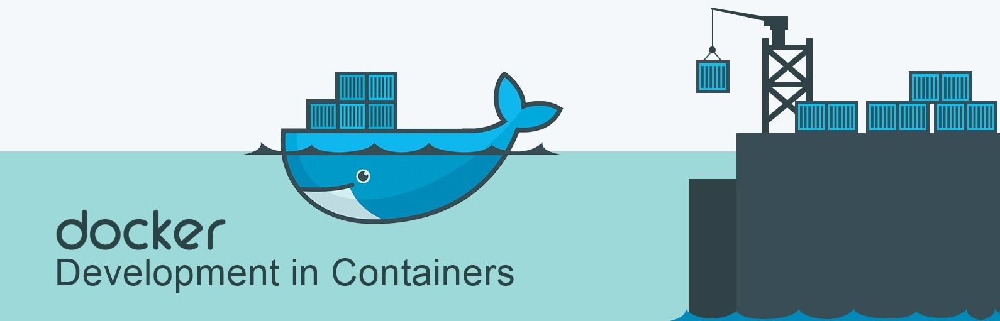

# Docker-Dev 101: A Step-by-Step Guide
[](https://opensource.org/licenses/MIT)
[](https://opensource.org/licenses/MIT)

Tutorial difficulty level: ✨ _made by a blonde, for blondes_ ✨
<p align="center">

</p>

## Docker-Dev
This tutorial assumes that the [previous one](https://github.com/PaulinoMoskwa/Hello-Docker) has already been seen.<br>
From the previous tutorial we learned how to use the following commands:
```commandline
docker build -t hello_docker .
docker run -d --name=hello_docker_container hello_docker sleep infinity
docker exec hello_docker_container python3 main.py
```

Note. The content of the files compared to the previous repo is very similar, it
just changed slightly the `main.py` and the `DockerFile`. In the `DockerFile` we
now create a working directory (for later convenience).<br>
The new `DockerFile` is the following:
```dockerfile
FROM python:3.9
ADD main.py .

WORKDIR /hello_docker_dev

ADD requirements.txt /tmp/requirements.txt
RUN pip install --no-cache-dir -r /tmp/requirements.txt
```

However, now, if we modify something in the `main.py`, such as even just adding
a `print('...')` we have to do everything all over again: create the image, run
the container and re-run the script. Too much.

To get the ability to edit the `main.py` and run it without having to re-do the
whole Docker-process from scratch, it is enough to slightly change the settings
of the `docker run` command.

Instead of the simple command:
```commandline
docker run -d --name=hello_docker_container hello_docker sleep infinity
```

We add: `-v </host/directory>:</container/directory>`.

The `-v` flag stands for "volume" and it creates a volume that allows to share
data between the host machine and the container. When we run a Docker container
with the `-v` flag, we specify a host directory and a container directory, 
separated by a colon, to create the volume. 

In our specific exemple, this would be:
```commandline
docker run -d -v absolute\path\to\Hello-Docker-Dev:/hello_docker_dev --name=hello_docker_container hello_docker sleep infinity
```

Now, running the command:
```commandline
docker exec hello_docker_container python3 main.py
```

we run the `main.py` as it is saved in the repository, obtaining the followin
output:
```commandline
A tensor from a list
tensor([1, 2, 3])
```

We modify the `main.py` by adding a simple print:
```python
import torch

print('Hello! This is a change made after the image and the container were created.')
print('A tensor from a list')
tensor = torch.tensor([1, 2, 3])
print(tensor)
```

And, by running again the command:
```commandline
docker exec hello_docker_container python3 main.py
```
we now get as output:
```commandline
Hello! This is a change made after the image and the container were created.
A tensor from a list
tensor([1, 2, 3])
```

## Docker Compose
Everything cool, but now the commands are getting quite long to remember and to
launch each time.

Let us introduce ✨ Docker Compose ✨, a tool for defining and running multi-container
Docker applications. With Compose, we use a single YAML file to configure everything.
Then, with a single command, we create and start all the services from the configuration.

We rewrite the same build and run components, but in single YAML file.

Note. Some things change: for example, the `sleep ininfity` is replaced with
`command: tail -F anything`.

The overall YAML looks like the following:
```yaml
services:
  hello_docker_dev_image:
    build: .
    container_name: hello_docker_container
    command: tail -F anything
    volumes:
      - absolute\path\to\Hello-Docker-Dev:/hello_docker_dev
```
The `build` line specifies where the `DockerFile` is located, the rest specifies
the name we want to give the container, additional commands and possibly the `-v` option.

Once this YAML is created, we can start the whole process with the following command:
```commandline
docker-compose up -d
```
Notice that the flag `-d` remains.

At this point we can do everything as we did before, so run the `main.py` 
(`docker exec hello_docker_container python3 main.py`), edit it, and re-run it, etc.

Once we are done (so, once we also stopped the container with the command
`docker stop hello_docker_container`), in order to shut down everything correctly
we use the command:
```commandline
docker-compose down
```

## Docker Compose Extra
Docker Compose is a very powerful tool. We can involve different images in different ways.

For example, suppose we want to launch our own application, and we want to lean
on Redis. It is possible to simply change the YAML in the following way:
```yaml
services:
  hello_docker_dev_image:
    build: .
    container_name: hello_docker_container
    command: tail -F anything
    volumes:
      - absolute\path\to\Hello-Docker-Dev:/hello_docker_dev
    depends_on:
      - redis_image
  
  redis_image:
    image: redis:alpine
```
In this case we are taking Redis from the Hub (the `alpine` version) and we are
making depend our content on that.

## Useful Resource/s
A [good resource](https://www.youtube.com/watch?v=0H2miBK_gAk&ab_channel=PatrickLoeber) for this topic.
